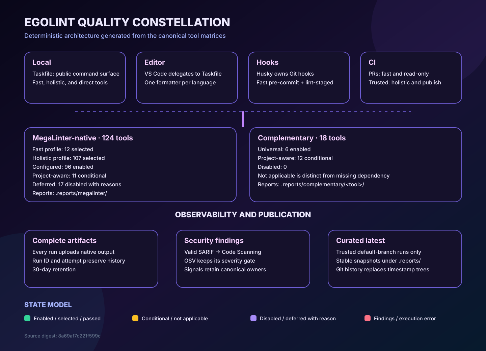

# Egolint lint architecture

This snapshot is generated from the canonical tool matrices. Edit the source
configuration and regenerate it; do not hand-edit the SVG or this legend.

## Tool inventory

<!-- prettier-ignore -->
| Layer | Total | Enabled / selected | Conditional / disabled |
| --- | ---: | ---: | ---: |
| MegaLinter-native | 124 | 94 enabled | 11 conditional; 19 disabled |
| MegaLinter fast profile | 124 | 12 selected | 112 excluded |
| MegaLinter holistic profile | 124 | 105 selected | 19 not selected |
| Complementary | 18 | 6 enabled | 12 conditional; 0 disabled |

## Execution paths

<!-- prettier-ignore -->
| Path | Contract |
| --- | --- |
| Local | Taskfile exposes fast, holistic, complementary, security, SBOM, and architecture commands. |
| VS Code | Repository tasks delegate to Taskfile and use canonical configuration paths. |
| Git hooks | Husky owns hooks; lint-staged and pre-commit run the bounded fast policy. |
| Pull requests | Read-only fast MegaLinter, commit policy, automation validation, OSV, and architecture generation. |
| Trusted runs | Default-branch pushes, schedules, and manual dispatches run holistic policy and may publish stable snapshots. |

## Result states

<!-- prettier-ignore -->
| State family | Meaning |
| --- | --- |
| Enabled / selected | Policy intentionally activates the tool in that context. |
| Conditional / not applicable | Project markers decide whether the tool should execute. |
| Disabled / deferred | Policy records the exact blocker or ownership reason. |
| Passed / warnings / findings | The tool executed and returned normalized results. |
| Missing / configuration / execution error | The tool could not produce a trustworthy lint result. |

## Report destinations

- MegaLinter native output: `.reports/megalinter/`
- Complementary normalized results: `.reports/complementary/<tool>/latest.json`
- OSV native and normalized output: `.reports/osv/`
- Supply-chain views: `.reports/supply-chain/`
- This architecture snapshot: `.reports/egolint/architecture/`
- Valid SARIF findings: GitHub Code Scanning
- Complete run history: GitHub Actions artifacts and Git history

Only trusted default-branch runs may commit curated `latest` snapshots. Pull
requests never receive report write permissions.

## Generation contract

- MegaLinter source: `egolint/.config/megalinter/tool-matrix.json`
- Complementary source: `egolint/.config/toolchain/tool-matrix.json`
- Source digest: `4f72bc47ca8c72f7501c0726e0c7d345c04a46a163a7cf4115aa26aefe5d2e6d`
