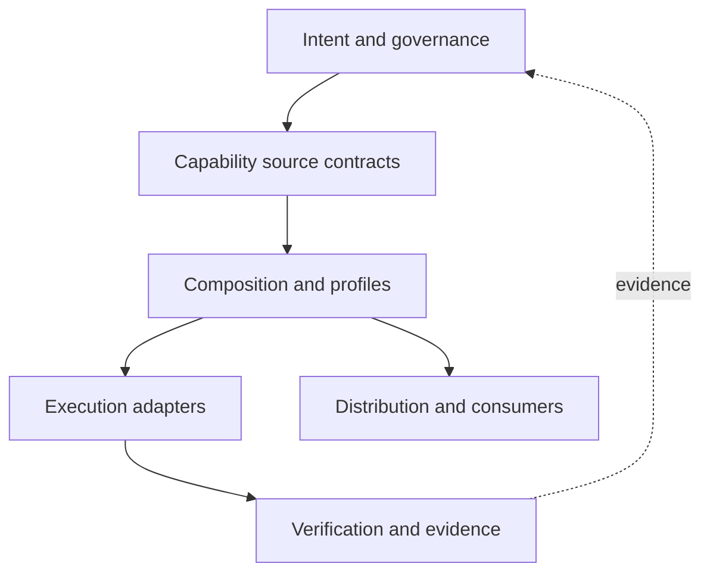

# Empathy Architecture

## Purpose and Scope

Empathy uses a layered integration architecture. Durable intent and capability contracts flow toward
composition, execution, verification, and consumer distribution. Evidence flows back toward human
review and architectural revision.

This document owns structural layers, allowed dependency direction, integration boundaries, and the
current repository mapping. Logical system responsibilities remain canonical in
[`SYSTEM.md`](SYSTEM.md).

## Structural Units or Layers

### Layer 1 — Intent and Governance

Owns purpose, vision, principles, human and AI authority, canonical language, decisions, design
intent, and strategic direction.

Primary artifacts are the root architecture documents, repository policy, ownership, contribution
and issue contracts, and durable decision records.

### Layer 2 — Capability Source Contracts

Owns reusable capability definitions independently of Empathy's integration choices.

Examples include Aether specifications/skills/agents, Egolint policy and fixtures, Relay workflow
contracts, and Realm environment contracts. A capability source may be colocated temporarily, but
its canonical owner remains explicit.

### Layer 3 — Composition and Profiles

Selects the universal core and optional capabilities, resolves versions and dependencies, applies
Empathy configuration, and defines the public repository task/profile interface.

Current examples are root Taskfile imports, root integration configurations, active workflow
selection, and the explicit active-versus-staged boundary. A machine-readable profile manifest is a
missing component.

### Layer 4 — Execution Adapters

Runs composed contracts in a concrete environment without redefining them.

Examples include Taskfile tasks, shell/Python adapters, Husky, pre-commit, VS Code tasks, dev
containers, GitHub composite actions, and workflows.

### Layer 5 — Verification and Evidence

Evaluates contracts and preserves results in the artifact type appropriate to their lifecycle.

Examples include unit/contract tests, MegaLinter and complementary-tool results, CodeQL, OSV,
OpenSSF, SARIF, generated architecture, `.reports/`, and `.audits/`.

### Layer 6 — Distribution and Consumer Integration

Produces traceable profile projections or distributions and allows a consumer repository to adopt,
configure, validate, upgrade, or remove them without losing local identity.

This layer is architectural target state; Empathy does not yet provide a stable end-to-end
distribution contract.

## Boundary Rules

1. Higher layers define meaning; lower layers implement or evaluate it.
2. An execution adapter may translate a capability contract but cannot silently change its policy.
3. Composition may select and configure a capability but cannot claim canonical ownership of its
   reusable source.
4. Verification may report evidence but cannot suppress findings or accept architecture decisions.
5. Distribution is derived from source and composition; generated consumer artifacts do not become
   upstream source accidentally.
6. Staging is outside active dependency paths. Active layers cannot import staged artifacts.
7. Consumer-specific identity, credentials, policy extensions, and desired state stay beyond the
   reusable source boundary.
8. Cross-layer shortcuts require an accepted decision and an explicit migration or review trigger.

## Dependency Direction

The allowed primary direction is:

Dependency inversion is allowed through stable contracts: for example, an owner-supplied interface
can let Composition invoke a capability without depending on its internal layout. Evidence feedback
may inform intent, but generated output does not directly mutate governance.

## Communication Patterns

- **File contracts:** Markdown, YAML, JSON, TOML, and configuration files carry versioned,
  reviewable intent.
- **Task contracts:** `task ...` commands provide the stable local integration surface.
- **Process results:** execution adapters communicate through exit status, normalized state, and
  namespaced report paths.
- **Workflow artifacts:** CI transports complete generated evidence without requiring it to be
  durable source.
- **SARIF:** supported security and quality findings integrate with code scanning.
- **Git history and pull requests:** material changes, review, and decision context remain traceable.
- **Future manifests:** profile, provenance, distribution, and consumer exception data should use
  versioned machine-readable contracts.

## Significant Constraints

- Public repository source must remain free of secrets and unnecessary personal data.
- Active GitHub automation uses least privilege, bounded runtimes, and immutable external references.
- Pull-request validation is read-only; trusted write paths are narrow and report-only where defined.
- Local and CI execution share canonical configuration.
- Generated outputs are deterministic where supported and separated from durable audits.
- Universal composition remains independent of application framework, cloud, release strategy, and
  consumer identity.
- Cross-platform behavior is preferred; environment-specific constraints are declared.
- Aether-derived intelligence artifacts cannot be reclassified as Egolint source by path alone.

## Relationship to System Inventory

| Logical system               | Primary structural layers             | Current repository evidence                           |
| ---------------------------- | ------------------------------------- | ----------------------------------------------------- |
| Foundation Contract          | Intent and Governance; Composition    | Root docs, `.github/`, policy files                   |
| Capability Composition       | Source Contracts; Composition         | `Taskfile.yml`, root configs, active/staged selection |
| Quality and Supply Chain     | Source Contracts through Verification | `egolint/`, root profiles, tests, reports             |
| Automation                   | Execution; Verification               | `.github/actions/`, `.github/workflows/`              |
| Intelligence Artifacts       | Source Contracts; Distribution target | `egolint/.agents/` provisional import                 |
| Development Environment      | Composition; Execution                | `.devcontainer/`, `.vscode/`, workspace/manifests     |
| Evidence and Observability   | Verification                          | `.reports/`, `.audits/`, workflow artifacts           |
| Staging and Classification   | Isolated from active layers           | `.staging/`                                           |
| Distribution and Conformance | Distribution target                   | Builders and projection concepts; no stable release   |

## Assumptions and Evidence Gaps

- **Observed:** The current architecture strongly implements Layers 3–5 for Egolint and GitHub
  automation.
- **Inferred:** The imported Aether builders are candidates for Layer 6, but their original paths and
  source assumptions have not been adapted into an accepted Empathy distribution boundary.
- **Missing:** A canonical profile schema, version-resolution contract, consumer exception model,
  and end-to-end conformance fixture.
- **Unresolved:** Holon may own part of Layers 3 and 6 at organization scale.

## Open Questions

- Where should the profile manifest and compatibility lock live?
- Which layer owns migration planning when a capability changes incompatibly?
- Should Empathy test extracted capabilities from released artifacts, source checkouts, or both?

## Validation

- Governing specification: `architecture-architecture` version `1.1.0`.
- Structural layers, dependency direction, boundaries, communication patterns, and constraints are
  explicit.
- The model separates system responsibility from physical layout and distinguishes current from
  target state.
- Staging has no active dependency path, and generated artifacts do not become source by accident.
