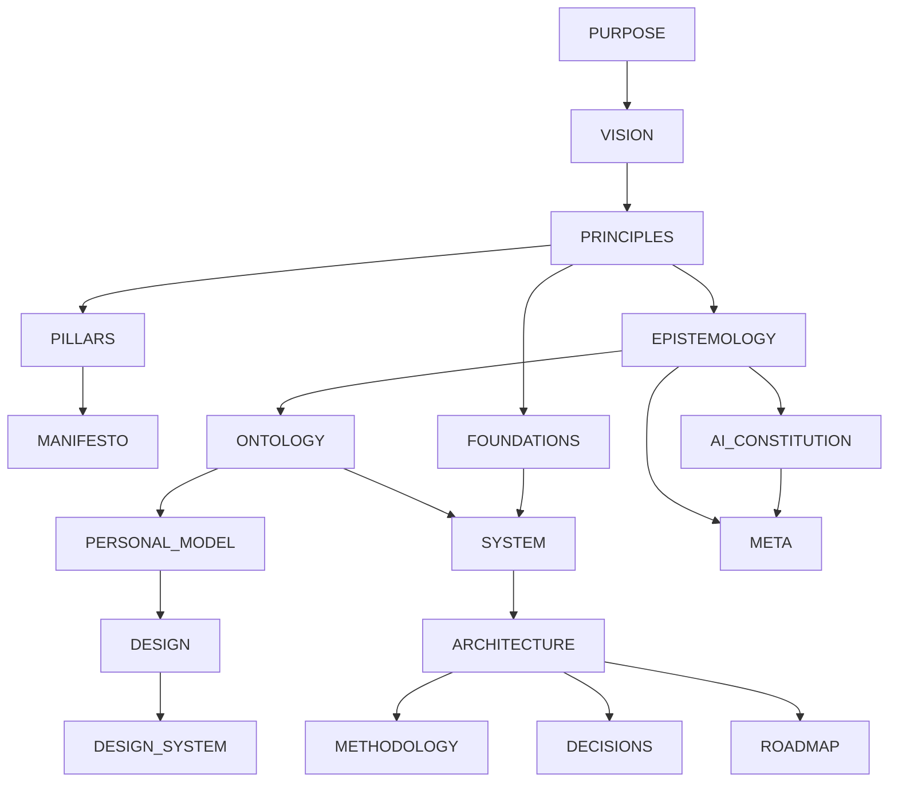

# Empathy Meta Architecture

## Architecture System Overview

Empathy's architecture system is an 18-document, repository-specific graph derived from reusable
Aether architecture specifications. Each document owns one bounded concern. Dependencies express
reading and authoring prerequisites; related links are informative and may be cyclic.

The documents are draft until human review. They describe Empathy's current architecture and honest
target boundaries. Empathy is the strict baseline template; Sanctuary owns incubation, and Holon
owns deterministic instantiation. Consuming Aether, Relay, Realm, Egolint, or another capability
does not make Empathy the canonical owner of that capability.

## Document Categories

| Category   | Concern                                                                                                     |
| ---------- | ----------------------------------------------------------------------------------------------------------- |
| Identity   | Why Empathy exists, the future it seeks, decision heuristics, enduring capabilities, and public commitments |
| Meta       | Evidence rules, AI authority, and governance of the architecture-document system                            |
| Domain     | Canonical concepts and the project's bounded assumptions about people                                       |
| Foundation | Durable invariants, logical systems, structural architecture, working method, and strategic evolution       |
| Experience | Experience philosophy and reusable design language                                                          |
| Governance | Significant accepted decisions and their lineage                                                            |

## Document Inventory

| Document                                   | Stable ID                 | Canonical concern                                                  | Governed by                          | Status |
| ------------------------------------------ | ------------------------- | ------------------------------------------------------------------ | ------------------------------------ | ------ |
| [`PURPOSE.md`](PURPOSE.md)                 | `empathy-purpose`         | Reason for existence, beneficiaries, enduring value, scope         | `architecture-purpose@2.0.0`         | Draft  |
| [`VISION.md`](VISION.md)                   | `empathy-vision`          | Desired future state, intended impact, directional signals         | `architecture-vision@2.0.0`          | Draft  |
| [`PRINCIPLES.md`](PRINCIPLES.md)           | `empathy-principles`      | Durable decision heuristics, precedence, exceptions                | `architecture-principles@2.0.0`      | Draft  |
| [`PILLARS.md`](PILLARS.md)                 | `empathy-pillars`         | Enduring strategic capabilities and health signals                 | `architecture-pillars@2.0.0`         | Draft  |
| [`MANIFESTO.md`](MANIFESTO.md)             | `empathy-manifesto`       | Public beliefs and credible commitments                            | `architecture-manifesto@2.0.0`       | Draft  |
| [`EPISTEMOLOGY.md`](EPISTEMOLOGY.md)       | `empathy-epistemology`    | Claim states, evidence, provenance, uncertainty, conflict          | `architecture-epistemology@2.0.0`    | Draft  |
| [`AI_CONSTITUTION.md`](AI_CONSTITUTION.md) | `empathy-ai-constitution` | AI authority, autonomy, risk, privacy, escalation                  | `architecture-ai-constitution@2.0.0` | Draft  |
| [`ONTOLOGY.md`](ONTOLOGY.md)               | `empathy-ontology`        | Canonical domain concepts, relationships, invariants, language     | `architecture-ontology@2.0.0`        | Draft  |
| [`PERSONAL_MODEL.md`](PERSONAL_MODEL.md)   | `empathy-personal-model`  | Human assumptions, agency, identity, consent, inference boundaries | `architecture-personal-model@2.0.0`  | Draft  |
| [`FOUNDATIONS.md`](FOUNDATIONS.md)         | `empathy-foundations`     | Durable assumptions, invariants, constraints, mental models        | `architecture-foundations@1.1.0`     | Draft  |
| [`SYSTEM.md`](SYSTEM.md)                   | `empathy-system`          | Logical systems, capability ownership, boundaries, flows           | `architecture-system@1.1.0`          | Draft  |
| [`ARCHITECTURE.md`](ARCHITECTURE.md)       | `empathy-architecture`    | Structural layers, dependency direction, integration boundaries    | `architecture-architecture@1.1.0`    | Draft  |
| [`DESIGN.md`](DESIGN.md)                   | `empathy-design`          | Experience philosophy, qualities, accessibility, agency, recovery  | `architecture-design@2.0.0`          | Draft  |
| [`DESIGN_SYSTEM.md`](DESIGN_SYSTEM.md)     | `empathy-design-system`   | Semantic visual, interaction, content, accessibility language      | `architecture-design-system@2.0.0`   | Draft  |
| [`METHODOLOGY.md`](METHODOLOGY.md)         | `empathy-methodology`     | Intentional discovery-through-reflection working loop              | `architecture-methodology@1.1.0`     | Draft  |
| [`DECISIONS.md`](DECISIONS.md)             | `empathy-decisions`       | Significant accepted choices, rationale, consequences, lineage     | `architecture-decisions@2.0.0`       | Draft  |
| [`ROADMAP.md`](ROADMAP.md)                 | `empathy-roadmap`         | Strategic capability evolution and dependencies                    | `architecture-roadmap@1.1.0`         | Draft  |
| [`META.md`](META.md)                       | `empathy-meta`            | Architecture inventory, ownership, graph, lifecycle, navigation    | `architecture-meta@2.0.0`            | Draft  |

## Canonical Ownership Map

| Concern                                          | Canonical artifact   |
| ------------------------------------------------ | -------------------- |
| Why Empathy exists                               | `PURPOSE.md`         |
| Desired future                                   | `VISION.md`          |
| Decision heuristics                              | `PRINCIPLES.md`      |
| Enduring capabilities                            | `PILLARS.md`         |
| Public cultural commitments                      | `MANIFESTO.md`       |
| Evidence and knowledge rules                     | `EPISTEMOLOGY.md`    |
| AI participation and authority                   | `AI_CONSTITUTION.md` |
| Domain language and conceptual invariants        | `ONTOLOGY.md`        |
| Bounded assumptions about people                 | `PERSONAL_MODEL.md`  |
| Durable architectural truths                     | `FOUNDATIONS.md`     |
| Logical systems and capability responsibility    | `SYSTEM.md`          |
| Structural organization and dependency direction | `ARCHITECTURE.md`    |
| Experience intent                                | `DESIGN.md`          |
| Reusable design language                         | `DESIGN_SYSTEM.md`   |
| Working and validation method                    | `METHODOLOGY.md`     |
| Accepted significant choices                     | `DECISIONS.md`       |
| Strategic future capability order                | `ROADMAP.md`         |
| Architecture-document system                     | `META.md`            |

Implementation, policy, specifications, audits, reports, and source code remain canonical for their
own concerns. Architecture documents reference those artifacts rather than absorbing their complete
content.

## Relationship Graph

The machine-validated frontmatter is authoritative when this visual and metadata differ.

## Reading Order

For orientation:

1. `PURPOSE.md`, `VISION.md`, and `PRINCIPLES.md` establish intent.
2. `ONTOLOGY.md` establishes language; `PERSONAL_MODEL.md` establishes human safeguards.
3. `FOUNDATIONS.md`, `SYSTEM.md`, and `ARCHITECTURE.md` establish the technical model.
4. `DESIGN.md` and `DESIGN_SYSTEM.md` establish the experience model.
5. `EPISTEMOLOGY.md` and `AI_CONSTITUTION.md` explain evidence and AI authority; read them earlier
   when authoring or reviewing AI-assisted work.
6. `METHODOLOGY.md`, `DECISIONS.md`, and `ROADMAP.md` explain change, accepted choices, and direction.
7. `META.md` provides navigation, validation status, and propagation rules.

## Authoring Order

The current baseline was authored in dependency order:

1. Identity: purpose → vision → principles → pillars → manifesto.
2. Meta prerequisites: epistemology → AI constitution.
3. Domain: ontology → personal model.
4. Foundation: foundations → system → architecture.
5. Experience: design → design system.
6. Evolution: methodology → decisions → roadmap.
7. Meta inventory after the complete graph existed.

Future updates begin at the canonical owner of the changed concern and propagate only as far as the
dependency impact requires.

## Lifecycle and Validation Status

All documents are version `0.1.0` and status `draft`. Draft means their structure and evidence are
ready for review but their claims and decisions have not received final human acceptance as an
architecture set.

The repository validates:

- required files and stable IDs;
- the `aether.architecture-document/v1` metadata shape;
- governing specification IDs and versions;
- dependency resolution and acyclicity;
- exactly one H1 and required validation sections;
- absence of template placeholders;
- synchronization between this inventory and the actual document set.

Semantic, evidence, accessibility, and authority review still require human judgment.

## Change Propagation

| Changed concern   | Minimum downstream review                                                       |
| ----------------- | ------------------------------------------------------------------------------- |
| Purpose or vision | Principles, pillars, manifesto, ontology, personal model, design, roadmap       |
| Principles        | Foundations, epistemology, AI constitution, design, methodology, decisions      |
| Epistemology      | AI constitution, ontology, personal model, decisions, audits and agent guidance |
| Ontology          | Personal model, system, architecture, design, manifests and public terminology  |
| Personal model    | AI constitution, design, design system, templates, metrics, privacy behavior    |
| Foundations       | System, architecture, methodology, decisions, profiles                          |
| System            | Architecture, methodology, decisions, profile ownership                         |
| Architecture      | Adapters, tests, decisions, roadmap, distribution design                        |
| Design            | Design system and every human-facing surface                                    |
| AI constitution   | Agent profiles, skills, instructions, permissions, automation, approvals        |
| Accepted decision | Affected canonical documents, implementation, tests, migration, roadmap         |
| Roadmap           | No automatic architecture change; initiatives must consume current architecture |

## Gaps and Intentional Omissions

- There is no separate glossary; `ONTOLOGY.md` owns canonical language.
- There is no architecture diagram image; Mermaid and tables remain source-native and reviewable.
- Detailed ADR files are omitted while the inline decision log remains manageable.
- Product UI specifications, data models, deployment architecture, and API contracts are omitted
  because Empathy does not currently own such a product runtime.
- A machine-readable profile manifest, consumer exception model, distribution schema, and migration
  contract remain roadmap gaps.
- The Aether corpus location is intentionally not normalized in this architecture pass; ownership and
  projection need an accepted decision first.

## Open Questions

- What review promotes this complete document set from draft to active?
- How should Empathy pin and consume Aether's released architecture validator after the
  materialization contract becomes stable?
- How will organization-level architecture reference Empathy without duplicating these concerns?
- Which future documents belong to profile specifications rather than this root architecture set?

## Validation

- Governing specification: `architecture-meta` version `2.0.0`.
- The inventory includes every applicable architecture document and one canonical owner per concern.
- Reading order, authoring order, graph, lifecycle, propagation, and omissions are explicit.
- The relationship graph is acyclic and is checked against document frontmatter.
