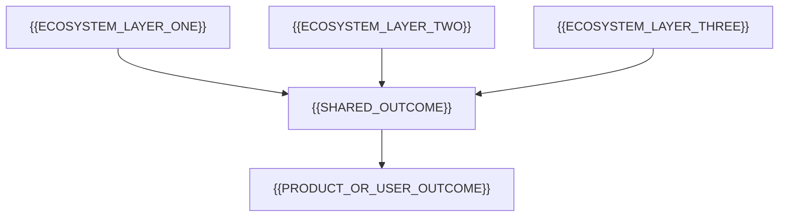

<!-- markdownlint-disable-file MD013 MD033 MD041 -->

<!--
HOLON PROFILE README CONTRACT

Primary audience: {{PRIMARY_AUDIENCE}}
Primary outcome: {{PRIMARY_OUTCOME}}

Materialization checklist:
1. Replace every {{UPPER_SNAKE_CASE}} token with verified public information.
2. Make the first screen answer identity, direction, credibility, and contact.
3. Pair skills with evidence and accomplishments with outcomes.
4. Feature three to five systems, not an uncurated repository inventory.
5. Remove restricted, proprietary, private, stale, or unverifiable claims.
6. Keep exactly one H1 and do not skip heading levels.
7. Prefer repository-owned assets and preserve useful alt text.
8. Keep generated regions bounded, deterministic, and optional.
9. Ensure the page remains coherent without external widgets or animation.
10. Remove this contract before publishing.
-->

  <picture>
    <source media="(prefers-color-scheme: dark)" srcset="./assets/profile/banner-dark.svg">
    <source media="(prefers-color-scheme: light)" srcset="./assets/profile/banner-light.svg">
    
  </picture>

# {{PROFILE_NAME}}

**{{PRIMARY_POSITIONING_STATEMENT}}**

{{PROFILE_INTRODUCTION}}

> **Open to:** {{TARGET_RELATIONSHIPS}} · {{WORK_STYLE}} · {{LOCATION_CONTEXT}}

[Portfolio]({{PORTFOLIO_URL}}) · [Résumé]({{RESUME_URL}}) · [Professional profile]({{PROFESSIONAL_PROFILE_URL}}) · [Email](mailto:{{PUBLIC_EMAIL}})

[Selected impact](#selected-impact) · [Featured systems](#featured-systems) · [Capabilities](#engineering-capabilities) · [Experience](#experience) · [Current focus](#current-focus) · [Contact](#contact)

## Thirty-second brief

- I build {{SYSTEM_TYPES_AND_SCALE}}.
- I care deeply about {{ENGINEERING_VALUES}}.
- My strongest work sits where {{DOMAIN_INTERSECTION}}.
- I bring {{EXPERIENCE_SUMMARY}}.
- I am currently turning {{CURRENT_PLATFORM_OR_PRACTICE}} into {{CURRENT_OUTCOME}}.

## Proof at a glance

<!-- Use four to six high-signal facts. Link evidence; do not substitute vanity counters. -->

| Signal | Evidence |
| --- | --- |
| Professional engineering | {{PROFESSIONAL_SCOPE_EVIDENCE}} |
| Education or training | {{EDUCATION_EVIDENCE}} |
| Platform or product portfolio | {{PORTFOLIO_SCOPE_EVIDENCE}} |
| Open-source delivery | {{OPEN_SOURCE_EVIDENCE}} |
| AI-assisted engineering | {{AI_WORKFLOW_EVIDENCE}} |
| Creative or interdisciplinary systems | {{CREATIVE_SYSTEMS_EVIDENCE}} |

## Selected impact

<!-- Express each result as context, owned action, outcome, and public evidence. -->

| Context | Engineering action | Result | Evidence |
| --- | --- | --- | --- |
| {{IMPACT_CONTEXT_ONE}} | {{IMPACT_ACTION_ONE}} | **{{IMPACT_RESULT_ONE}}** | [{{IMPACT_EVIDENCE_LABEL_ONE}}]({{IMPACT_EVIDENCE_URL_ONE}}) |
| {{IMPACT_CONTEXT_TWO}} | {{IMPACT_ACTION_TWO}} | **{{IMPACT_RESULT_TWO}}** | [{{IMPACT_EVIDENCE_LABEL_TWO}}]({{IMPACT_EVIDENCE_URL_TWO}}) |
| {{IMPACT_CONTEXT_THREE}} | {{IMPACT_ACTION_THREE}} | **{{IMPACT_RESULT_THREE}}** | [{{IMPACT_EVIDENCE_LABEL_THREE}}]({{IMPACT_EVIDENCE_URL_THREE}}) |
| {{IMPACT_CONTEXT_FOUR}} | {{IMPACT_ACTION_FOUR}} | **{{IMPACT_RESULT_FOUR}}** | [{{IMPACT_EVIDENCE_LABEL_FOUR}}]({{IMPACT_EVIDENCE_URL_FOUR}}) |

## Featured systems

<!-- Select three to five complementary systems and coordinate them with pinned repositories. -->

### [{{FEATURED_PROJECT_ONE}}]({{FEATURED_PROJECT_ONE_URL}})

**{{FEATURED_PROJECT_ONE_PROMISE}}**

{{FEATURED_PROJECT_ONE_CASE_STUDY}}

`{{PROJECT_ONE_CONCEPT_ONE}}` · `{{PROJECT_ONE_CONCEPT_TWO}}` · `{{PROJECT_ONE_CONCEPT_THREE}}`

[Architecture]({{FEATURED_PROJECT_ONE_ARCHITECTURE_URL}}) · [Documentation]({{FEATURED_PROJECT_ONE_DOCS_URL}}) · [Proof]({{FEATURED_PROJECT_ONE_PROOF_URL}})

### [{{FEATURED_PROJECT_TWO}}]({{FEATURED_PROJECT_TWO_URL}})

**{{FEATURED_PROJECT_TWO_PROMISE}}**

{{FEATURED_PROJECT_TWO_CASE_STUDY}}

`{{PROJECT_TWO_CONCEPT_ONE}}` · `{{PROJECT_TWO_CONCEPT_TWO}}` · `{{PROJECT_TWO_CONCEPT_THREE}}`

[Architecture]({{FEATURED_PROJECT_TWO_ARCHITECTURE_URL}}) · [Documentation]({{FEATURED_PROJECT_TWO_DOCS_URL}}) · [Proof]({{FEATURED_PROJECT_TWO_PROOF_URL}})

### [{{FEATURED_PROJECT_THREE}}]({{FEATURED_PROJECT_THREE_URL}})

**{{FEATURED_PROJECT_THREE_PROMISE}}**

{{FEATURED_PROJECT_THREE_CASE_STUDY}}

`{{PROJECT_THREE_CONCEPT_ONE}}` · `{{PROJECT_THREE_CONCEPT_TWO}}` · `{{PROJECT_THREE_CONCEPT_THREE}}`

[Architecture]({{FEATURED_PROJECT_THREE_ARCHITECTURE_URL}}) · [Documentation]({{FEATURED_PROJECT_THREE_DOCS_URL}}) · [Proof]({{FEATURED_PROJECT_THREE_PROOF_URL}})

## Ecosystem architecture

<!-- Conditional: keep only when the profile genuinely coordinates a multi-project system. -->

{{ECOSYSTEM_NAME}} is {{ECOSYSTEM_EXPLANATION}}.

| Layer | Responsibility | Evidence |
| --- | --- | --- |
| {{LAYER_ONE_NAME}} | {{LAYER_ONE_RESPONSIBILITY}} | [{{LAYER_ONE_EVIDENCE_LABEL}}]({{LAYER_ONE_EVIDENCE_URL}}) |
| {{LAYER_TWO_NAME}} | {{LAYER_TWO_RESPONSIBILITY}} | [{{LAYER_TWO_EVIDENCE_LABEL}}]({{LAYER_TWO_EVIDENCE_URL}}) |
| {{LAYER_THREE_NAME}} | {{LAYER_THREE_RESPONSIBILITY}} | [{{LAYER_THREE_EVIDENCE_LABEL}}]({{LAYER_THREE_EVIDENCE_URL}}) |

[Explore the complete architecture]({{ECOSYSTEM_ARCHITECTURE_URL}})

## Engineering capabilities

<!-- Mention a technology only when it can be discussed or demonstrated. -->

| Capability | Technologies and practices | Evidence |
| --- | --- | --- |
| Platform and developer experience | {{PLATFORM_PRACTICES}} | [{{PLATFORM_EVIDENCE_LABEL}}]({{PLATFORM_EVIDENCE_URL}}) |
| Backend and systems | {{BACKEND_PRACTICES}} | [{{BACKEND_EVIDENCE_LABEL}}]({{BACKEND_EVIDENCE_URL}}) |
| CI/CD and release engineering | {{DELIVERY_PRACTICES}} | [{{DELIVERY_EVIDENCE_LABEL}}]({{DELIVERY_EVIDENCE_URL}}) |
| Containers and reproducibility | {{REPRODUCIBILITY_PRACTICES}} | [{{REPRODUCIBILITY_EVIDENCE_LABEL}}]({{REPRODUCIBILITY_EVIDENCE_URL}}) |
| AI agents and knowledge systems | {{AI_PRACTICES}} | [{{AI_EVIDENCE_LABEL}}]({{AI_EVIDENCE_URL}}) |
| Testing, quality, and observability | {{QUALITY_PRACTICES}} | [{{QUALITY_EVIDENCE_LABEL}}]({{QUALITY_EVIDENCE_URL}}) |
| Cross-platform tooling | {{CROSS_PLATFORM_PRACTICES}} | [{{CROSS_PLATFORM_EVIDENCE_LABEL}}]({{CROSS_PLATFORM_EVIDENCE_URL}}) |

## Experience

<!-- Keep the profile concise; link a résumé for complete chronology. -->

### {{CURRENT_OR_RECENT_ROLE}} · {{ORGANIZATION_NAME}}

*{{ROLE_DATES}} · {{ROLE_LOCATION}}*

{{ROLE_SUMMARY}}

- {{ROLE_OUTCOME_ONE}}.
- {{ROLE_OUTCOME_TWO}}.
- {{ROLE_OUTCOME_THREE}}.

### Additional experience

{{ADDITIONAL_EXPERIENCE_SUMMARY}}

## Education and continued learning

- **{{DEGREE_OR_PROGRAM_ONE}}** — {{INSTITUTION_ONE}}, {{COMPLETION_ONE}}.
- **{{DEGREE_OR_PROGRAM_TWO}}** — {{INSTITUTION_TWO}}, {{COMPLETION_TWO}}.
- {{CERTIFICATION_PUBLICATION_OR_CONTINUING_EDUCATION}}.

## Open source and collaboration

- {{OPEN_SOURCE_SIGNAL_ONE}}.
- {{OPEN_SOURCE_SIGNAL_TWO}}.
- {{COLLABORATION_OR_MENTORING_SIGNAL}}.

## Creative practice

<!-- Conditional: connect creative work to the professional narrative. -->

{{CREATIVE_PRACTICE_INTRODUCTION}}

- **{{CREATIVE_SYSTEM_ONE}}** — {{CREATIVE_SYSTEM_ONE_OUTCOME}}.
- **{{CREATIVE_SYSTEM_TWO}}** — {{CREATIVE_SYSTEM_TWO_OUTCOME}}.
- **{{CREATIVE_BODY_OF_WORK}}** — {{CREATIVE_BODY_OF_WORK_SIGNIFICANCE}}.

## Current focus

- Building {{CURRENT_FOCUS_ONE}}.
- Hardening {{CURRENT_FOCUS_TWO}}.
- Exploring {{CURRENT_FOCUS_THREE}}.

<!-- profile:recent-work:START -->
{{RECENT_RELEASES_WRITING_OR_MILESTONES}}
<!-- profile:recent-work:END -->

## Activity and signals

<!-- Optional: prefer one repository-owned generated summary over several external widgets. -->

  
View selected public activity

   

  <picture>
    <source media="(prefers-color-scheme: dark)" srcset="./assets/generated/activity-dark.svg">
    <source media="(prefers-color-scheme: light)" srcset="./assets/generated/activity-light.svg">
    
  </picture>

## Writing and notes

- [{{WRITING_TITLE_ONE}}]({{WRITING_URL_ONE}}) — {{WRITING_RELEVANCE_ONE}}.
- [{{WRITING_TITLE_TWO}}]({{WRITING_URL_TWO}}) — {{WRITING_RELEVANCE_TWO}}.
- [{{WRITING_TITLE_THREE}}]({{WRITING_URL_THREE}}) — {{WRITING_RELEVANCE_THREE}}.

## Contact

- **{{CONTACT_RELATIONSHIP_ONE}}:** [{{CONTACT_CHANNEL_ONE}}]({{CONTACT_URL_ONE}}).
- **{{CONTACT_RELATIONSHIP_TWO}}:** [{{CONTACT_CHANNEL_TWO}}]({{CONTACT_URL_TWO}}).
- **{{CONTACT_RELATIONSHIP_THREE}}:** [{{CONTACT_CHANNEL_THREE}}]({{CONTACT_URL_THREE}}).

{{CONTACT_INVITATION}}

<a href="#profile-top">Back to top</a>

