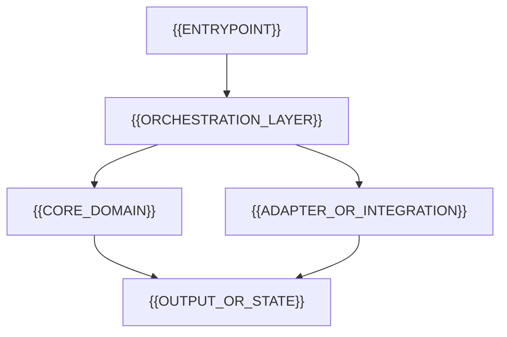

<!-- markdownlint-disable-file MD013 MD033 MD041 -->

<!--
HOLON PROJECT README CONTRACT

Audience: {{PRIMARY_AUDIENCE}}
Repository type: {{REPOSITORY_TYPE}}
Maturity: {{MATURITY}}

Materialization checklist:
1. Replace every {{UPPER_SNAKE_CASE}} token with verified repository context.
2. Keep the required sections declared by holon/packs/readme/pack.yaml.
3. Delete conditional sections that do not reduce uncertainty for this audience.
4. Keep exactly one H1 and do not skip heading levels.
5. Keep the first screen focused on identity, value, state, proof, and one action.
6. Use repository-relative links for repository-owned files and assets.
7. Keep at most five meaningful badges above the fold.
8. Give every meaningful image concise, descriptive alt text.
9. Test every command from a clean environment.
10. Move deep reference material into docs/ and remove this contract before publishing.
-->

<a id="readme-top"></a>

<p align="center">
  <picture>
    <source media="(prefers-color-scheme: dark)" srcset="./docs/assets/banner-dark.svg">
    <source media="(prefers-color-scheme: light)" srcset="./docs/assets/banner-light.svg">
    
  </picture>
</p>

# {{PROJECT_NAME}}

> **{{ONE_SENTENCE_PROMISE}}**

{{OVERVIEW}}

<!-- Enable only badges that answer an adoption question; remove unconfigured badges. -->

[![Build status][build-badge]][build-url]
[![Latest release][release-badge]][release-url]
[![Security status][security-badge]][security-url]
[![Documentation][docs-badge]][docs-url]
[![License][license-badge]][license-url]

[Quick start](#quick-start) · [Documentation][docs-url] · [Usage](#usage) · [Contributing][contributing-url] · [Support](#support)

<!-- Use a screenshot, terminal capture, compact example, or generated result. -->

[][demo-url]

## Why {{PROJECT_NAME}}

{{PROBLEM_STATEMENT}}

{{PROJECT_NAME}} addresses this by {{SOLUTION_SUMMARY}}.

### Design goals

- **{{GOAL_ONE}}:** {{GOAL_ONE_EXPLANATION}}.
- **{{GOAL_TWO}}:** {{GOAL_TWO_EXPLANATION}}.
- **{{GOAL_THREE}}:** {{GOAL_THREE_EXPLANATION}}.

### Non-goals

<!-- Keep this boundary only when it prevents a plausible adoption mistake. -->

- {{NON_GOAL_ONE}}.
- {{NON_GOAL_TWO}}.

## Highlights

- **{{CAPABILITY_ONE}}** — {{OUTCOME_ONE}}.
- **{{CAPABILITY_TWO}}** — {{OUTCOME_TWO}}.
- **{{CAPABILITY_THREE}}** — {{OUTCOME_THREE}}.
- **{{CAPABILITY_FOUR}}** — {{OUTCOME_FOUR}}.

## At a glance

| Concern | Answer |
| --- | --- |
| Primary interface | {{PRIMARY_INTERFACE}} |
| Maturity | {{MATURITY_AND_STABILITY_EXPECTATION}} |
| Supported platforms | {{SUPPORTED_PLATFORMS}} |
| Runtime | {{RUNTIME_AND_VERSION_RANGE}} |
| Distribution | {{DISTRIBUTION_CHANNELS}} |
| License | [{{LICENSE_NAME}}](./LICENSE) |

## Quick start

The shortest path from a clean environment to a successful result is:

### Prerequisites

- {{PREREQUISITE_ONE}}.
- {{PREREQUISITE_TWO}}.

### Install

```sh
{{PRIMARY_INSTALL_COMMAND}}
```

### Run

```sh
{{PRIMARY_RUN_COMMAND}}
```

Expected result:

```text
{{SUCCESS_PROOF}}
```

## Installation

<!-- Conditional: retain when installation differs by platform or channel. -->

| Environment | Command or artifact | Notes |
| --- | --- | --- |
| macOS | `{{MACOS_INSTALL_COMMAND}}` | {{MACOS_NOTES}} |
| Linux | `{{LINUX_INSTALL_COMMAND}}` | {{LINUX_NOTES}} |
| Windows | `{{WINDOWS_INSTALL_COMMAND}}` | {{WINDOWS_NOTES}} |
| Container | `{{CONTAINER_REFERENCE}}` | {{CONTAINER_NOTES}} |
| From source | See [development setup](#development) | {{SOURCE_BUILD_NOTES}} |

Verify, upgrade, or remove the installation:

```sh
{{VERIFY_COMMAND}}
{{UPGRADE_COMMAND}}
{{UNINSTALL_COMMAND}}
```

## Usage

```sh
{{REALISTIC_USAGE_EXAMPLE}}
```

### Common workflows

#### {{WORKFLOW_ONE_NAME}}

{{WORKFLOW_ONE_PURPOSE}}

```sh
{{WORKFLOW_ONE_COMMANDS}}
```

#### {{WORKFLOW_TWO_NAME}}

{{WORKFLOW_TWO_PURPOSE}}

```sh
{{WORKFLOW_TWO_COMMANDS}}
```

For the complete interface, see the [reference documentation]({{REFERENCE_DOCUMENTATION_PATH}}).

## Configuration

<!-- Conditional: state precedence whenever flags, environment, files, or defaults overlap. -->

Configuration resolves in this order:

1. {{HIGHEST_PRECEDENCE_SOURCE}}.
2. {{SECOND_PRECEDENCE_SOURCE}}.
3. {{THIRD_PRECEDENCE_SOURCE}}.
4. Built-in defaults.

| Setting | Environment variable or key | Default | Required | Purpose |
| --- | --- | --- | --- | --- |
| {{SETTING_ONE}} | `{{VARIABLE_ONE}}` | `{{DEFAULT_ONE}}` | {{YES_OR_NO}} | {{SETTING_ONE_PURPOSE}} |
| {{SETTING_TWO}} | `{{VARIABLE_TWO}}` | `{{DEFAULT_TWO}}` | {{YES_OR_NO}} | {{SETTING_TWO_PURPOSE}} |
| {{SETTING_THREE}} | `{{VARIABLE_THREE}}` | `{{DEFAULT_THREE}}` | {{YES_OR_NO}} | {{SETTING_THREE_PURPOSE}} |

Never commit secrets. {{SECRET_MANAGEMENT_GUIDANCE}}

## Architecture

<!-- Conditional for small repositories; keep the diagram conceptual and link deeper design. -->



| Component | Responsibility | Boundary |
| --- | --- | --- |
| `{{COMPONENT_ONE}}` | {{RESPONSIBILITY_ONE}} | {{BOUNDARY_ONE}} |
| `{{COMPONENT_TWO}}` | {{RESPONSIBILITY_TWO}} | {{BOUNDARY_TWO}} |
| `{{COMPONENT_THREE}}` | {{RESPONSIBILITY_THREE}} | {{BOUNDARY_THREE}} |

See [architecture documentation](./docs/architecture/README.md) and
[architecture decisions](./docs/decisions/) for deeper context.

## Repository layout

```text
.
├── {{SOURCE_DIRECTORY}}/        # {{SOURCE_DIRECTORY_PURPOSE}}
├── {{TEST_DIRECTORY}}/          # {{TEST_DIRECTORY_PURPOSE}}
├── docs/                        # Guides, architecture, and reference
├── examples/                    # Executable examples
└── {{PRIMARY_ENTRY_FILE}}       # {{PRIMARY_ENTRY_FILE_PURPOSE}}
```

## Compatibility

| Surface | Supported | Notes |
| --- | --- | --- |
| macOS | {{MACOS_SUPPORTED_RANGE}} | {{MACOS_COMPATIBILITY_NOTES}} |
| Linux | {{LINUX_SUPPORTED_RANGE}} | {{LINUX_COMPATIBILITY_NOTES}} |
| Windows | {{WINDOWS_SUPPORTED_RANGE}} | {{WINDOWS_COMPATIBILITY_NOTES}} |
| Container or CI | {{CONTAINER_SUPPORTED_RANGE}} | {{CONTAINER_COMPATIBILITY_NOTES}} |
| Runtime or API | {{API_SUPPORTED_RANGE}} | {{API_COMPATIBILITY_NOTES}} |

See the [support policy]({{SUPPORT_POLICY_PATH}}) for version lifetimes,
deprecations, and intentionally unsupported combinations.

## Documentation

| Need | Start here |
| --- | --- |
| Concepts and guides | [{{GUIDES_LABEL}}]({{GUIDES_PATH}}) |
| API or command reference | [{{REFERENCE_LABEL}}]({{REFERENCE_PATH}}) |
| Architecture and decisions | [{{ARCHITECTURE_LABEL}}]({{ARCHITECTURE_PATH}}) |
| Changes and migrations | [{{CHANGELOG_LABEL}}]({{CHANGELOG_PATH}}) |

## Development

### Bootstrap a clean checkout

```sh
git clone "https://github.com/{{OWNER}}/{{REPOSITORY}}.git"
cd "{{REPOSITORY}}"
{{DEVELOPMENT_BOOTSTRAP_COMMAND}}
```

### Run and validate

```sh
{{DEVELOPMENT_RUN_COMMAND}}
{{FORMAT_CHECK_COMMAND}}
{{LINT_COMMAND}}
{{STATIC_ANALYSIS_COMMAND}}
{{TEST_COMMAND}}
{{BUILD_COMMAND}}
```

### Quality gates

| Gate | Local command | CI job | Required |
| --- | --- | --- | --- |
| Format | `{{FORMAT_CHECK_COMMAND}}` | `{{FORMAT_JOB}}` | Yes |
| Lint | `{{LINT_COMMAND}}` | `{{LINT_JOB}}` | Yes |
| Tests | `{{TEST_COMMAND}}` | `{{TEST_JOB}}` | Yes |
| Build | `{{BUILD_COMMAND}}` | `{{BUILD_JOB}}` | Yes |
| Security | `{{SECURITY_CHECK_COMMAND}}` | `{{SECURITY_JOB}}` | {{SECURITY_GATE_REQUIRED}} |

## Operations

<!-- Conditional: keep for deployable services, scheduled automation, and long-running apps. -->

### Deploy

{{DEPLOYMENT_SUMMARY}}

### Observe

| Signal | Location | Healthy state |
| --- | --- | --- |
| Health | `{{HEALTH_ENDPOINT_OR_COMMAND}}` | {{HEALTHY_STATE}} |
| Logs | {{LOG_LOCATION}} | {{EXPECTED_LOG_STATE}} |
| Metrics | {{METRICS_LOCATION}} | {{EXPECTED_METRIC_STATE}} |
| Traces | {{TRACE_LOCATION}} | {{EXPECTED_TRACE_STATE}} |

### Recover

See the [runbook]({{RUNBOOK_PATH}}) for rollback, restore, and incident
procedures.

## Troubleshooting

### {{COMMON_FAILURE_ONE}}

**Symptom:** {{SYMPTOM_ONE}}

**Cause:** {{CAUSE_ONE}}

**Resolution:** {{RESOLUTION_ONE}}

### {{COMMON_FAILURE_TWO}}

**Symptom:** {{SYMPTOM_TWO}}

**Cause:** {{CAUSE_TWO}}

**Resolution:** {{RESOLUTION_TWO}}

For unresolved problems, gather diagnostics with `{{DIAGNOSTIC_COMMAND}}` and
follow the [support path](#support).

## Security

Do not report vulnerabilities through a public issue. Follow
[the security policy](./SECURITY.md) for supported versions and private
reporting instructions.

{{SECURITY_BOUNDARY_SUMMARY}}

## Roadmap

Current priorities are tracked in the [project roadmap][roadmap-url] and
[open issues][issues-url].

- [x] {{COMPLETED_MILESTONE}}.
- [ ] {{CURRENT_MILESTONE}}.
- [ ] {{FUTURE_MILESTONE}}.

Roadmap items describe intent, not a delivery guarantee.

## Support

| Need | Channel |
| --- | --- |
| Usage question | [Start a discussion][discussions-url] |
| Reproducible bug | [Open a bug report][bug-report-url] |
| Feature proposal | [Open a feature request][feature-request-url] |
| Security concern | Follow [the security policy](./SECURITY.md) |

## Contributing

Contributions are welcome. Read [the contribution guide][contributing-url] for
environment setup, branch and commit conventions, quality gates, and the
pull-request process.

By participating, you agree to follow the [code of conduct][code-of-conduct-url].

## Releases and versioning

{{PROJECT_NAME}} follows [Semantic Versioning](https://semver.org/){{VERSIONING_QUALIFIER}}.
See the [changelog][changelog-url] for notable changes and the
[releases page][release-url] for artifacts.

## License

{{PROJECT_NAME}} is distributed under the [{{LICENSE_NAME}}](./LICENSE).

## Acknowledgments

- [{{ACKNOWLEDGMENT_ONE_NAME}}]({{ACKNOWLEDGMENT_ONE_URL}}) — {{ACKNOWLEDGMENT_ONE_REASON}}.
- [{{ACKNOWLEDGMENT_TWO_NAME}}]({{ACKNOWLEDGMENT_TWO_URL}}) — {{ACKNOWLEDGMENT_TWO_REASON}}.

<p align="right"><a href="#readme-top">Back to top</a></p>

[build-badge]: https://img.shields.io/github/actions/workflow/status/{{OWNER}}/{{REPOSITORY}}/{{WORKFLOW_FILE}}?branch={{DEFAULT_BRANCH}}&style=flat-square&label=build
[build-url]: https://github.com/{{OWNER}}/{{REPOSITORY}}/actions/workflows/{{WORKFLOW_FILE}}
[release-badge]: https://img.shields.io/github/v/release/{{OWNER}}/{{REPOSITORY}}?style=flat-square&sort=semver
[release-url]: https://github.com/{{OWNER}}/{{REPOSITORY}}/releases
[security-badge]: {{SECURITY_BADGE_URL}}
[security-url]: {{SECURITY_REPORT_URL}}
[docs-badge]: https://img.shields.io/badge/docs-available-6f42c1?style=flat-square
[docs-url]: {{DOCUMENTATION_URL_OR_RELATIVE_PATH}}
[license-badge]: https://img.shields.io/github/license/{{OWNER}}/{{REPOSITORY}}?style=flat-square
[license-url]: https://github.com/{{OWNER}}/{{REPOSITORY}}/blob/{{DEFAULT_BRANCH}}/LICENSE
[demo-url]: {{DEMO_URL}}
[roadmap-url]: {{ROADMAP_URL_OR_RELATIVE_PATH}}
[issues-url]: https://github.com/{{OWNER}}/{{REPOSITORY}}/issues
[discussions-url]: https://github.com/{{OWNER}}/{{REPOSITORY}}/discussions
[bug-report-url]: https://github.com/{{OWNER}}/{{REPOSITORY}}/issues/new?template=bug_report.yml
[feature-request-url]: https://github.com/{{OWNER}}/{{REPOSITORY}}/issues/new?template=feature_request.yml
[contributing-url]: ./CONTRIBUTING.md
[code-of-conduct-url]: ./CODE_OF_CONDUCT.md
[changelog-url]: ./CHANGELOG.md
